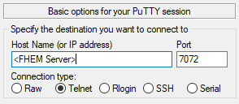
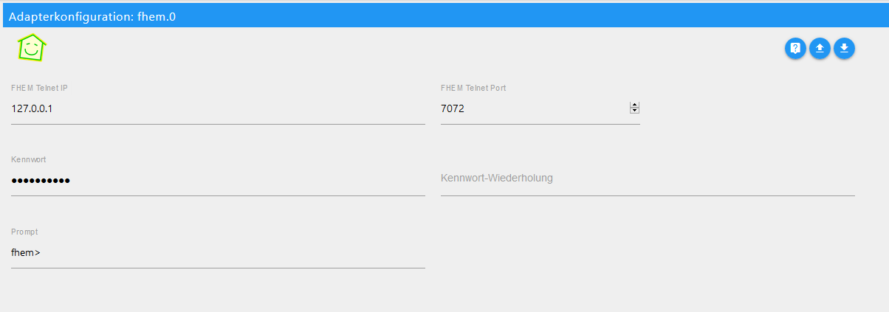
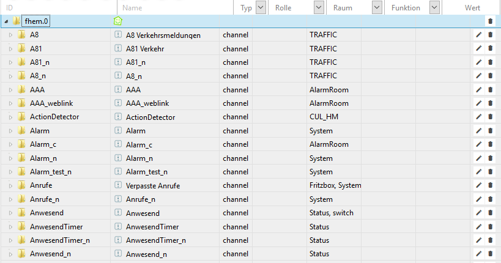

---
title:       "FHEM-Adapter"
lastChanged: "22.09.2018"
editLink:    "https://github.com/ioBroker/ioBroker.fhem/blob/master/docs/de/README.md"
---)

!>Achtung!   
Seite ist im Aufbau!  
    
# &emsp;FHEM-Adapter
Der FHEM-Adapter ermöglicht die einfache Einbindung eines oder auch mehrerer FHEM Servern in ein ioBroker-System.

Alle Module aus FHEM können eingelesen, über ioBroker gesteuert und zur Visualisierung verwendet werden.

<!-- Einführungsbild-->
   
*FHEM Oberfläche*

Inhaltsverzeichnis

| Navigation                          |
|-------------------------------------|
| 1  [Steckbrief](#steckbrief)        |  
| 2  [Überblick](#überblick)          |
| 3  [Installation](#installation)    |
| 4  [Konfiguration](#konfiguration)  |
| 5  [Instanz](#instanz)              |
| 6  [Objekte des Adapters](#objekte)           |
| 6.1 [Modul aus FHEM Typ:channel](#objekte_c)  |
| 6.2 [info](#objekte_i)            |
| 7  [Besonderheiten](#besonderheiten)|
| 8  [FAQ](#faq)                      |
| 9  [Beispiele](#beispiele)          |
| 10 [Deinstallation](#deinstallation)|
| 11 [Links](#links)                  |
| 12 [Historie](#historie)            |

<a name="steckbrief"/>

## Steckbrief
> Achtung! Die folgende Tabelle dient nur als Beispiel. Sie wird vom
  Dokumentengenerator dynamisch erzeugt und an dieser Stelle eingefügt.
  Je nach den ausgewählten Feldern sind die Datenquellen z.B. `frontmatter`,
  `io-package.json` und `package.json` des jeweilgen Adapters.

|                         |                              |
|-------------------------|:----------------------------:|
| Stand der Doku          | {date:}                      |
| aktuelle Version stable | ![stable][logo]              |
| aktuelle Version latest | ![latest][logo]              |
| OS                      | unterstützte OS              |
| node-Version            | unterstützte node-Versionen  |
| Entwickler              | Name/Alias des Entwicklers   |
| Github                  | https://github.com/ioBroker/ioBroker.fhem                    |
| Lizenz                  | MIT                          |
| Kategorie               | Iot-Systeme           |
| Keywords                | `iobroker` `fhem` `smarthome`                |
| Abhängigkeiten          | `dependencies`               |      

<a name="überblick"/>

## Überblick

### FHEM
FHEM bietet eine Vielzahl an Modulen mit diversen Protokollen.
Durch die Einbindung in ioBroker können alle FHEM Module in Verbindung mit sämtlichen ioBroker-Adaptern wie Alexa, VIS, Material usw genutzt werden.

### FHEM-Adapter
Nach erfolgreicher Verbindung zum FHEM Server werden alle Module automatisch eingelsen (jsonlist2)
Eine Möglichkeit zur Einschränkung der eingelesenen Module ist die Verwendung von einem Raum `room = ioBroker` in FHEM.
Nach der Synchronisation mit FHEM werden alle Zustände / Änderungen und auch neue Module übertragen.

<a name="voraussetzungen"/>

## Voraussetzungen vor der Installation
> Bei der Installation FHEM-Server wird ein telnet-Modul mit Namen `telnetPort` automatisch angelegt.

Der FHEM Befehl `list telnetPort` sollte deshalb folgendes Ergebnis bringen:

  
*FHEM telnetPort*

Falls nicht vorhanden, mit FHEM Befehl `define telnetPort telnet 7072 global` anlegen.

> Zusätlich kann noch ein Passwort für die Telnet Verbindung gesetzt werden.

Der FHEM Befehl `list allowed_telnetPort` sollte folgendes Ergebnis bringen:

  
*FHEM telnetPort Passwort*

Falls nicht vorhanden oder unvollständig, mit folgenden Befehlen anlegen/ergänzen/ändern: 

* `define allowed_telnetPort allowed` Anlage allowed-Modul mit Name allowed_telnetPort
* `attr allowed_telnetPort validFor telnetPort` Zuordnung telnet-Modul Name telnetPort
* `set allowed_telnetPort password <passwort>` Passwort setzen

> Zum Abschluß ist ein Test der Verbindung mit zB PuTTY zu empfehlen! (Download unter [Links](#links)) 

  
*Putty1*

  
*Putty Passwort*

* Eingabe Passwort und 2 * Return!

  
*Putty Prompt*

* `jsonlist2` FHEM Module
* `inform on` FHEM events 

<a name="installation"/>

## Installation

> Eine Instanz des Adapters wird über die ioBroker Admin-Oberfläche installiert.
  Die ausführliche Anleitung für die dazu notwendigen Installatonschritte ist
  **hier** beschrieben.

<a name="konfiguration"/>

##  Konfiguration
Die Adapterkonfiguration beschränkt sich auf Angaben zum FHEM Server und Telnet Schnittstelle.

<a name="{Eindeutiger Fensterbezeichner}"/>

  
*Adapterkonfiguration*

| Feld               | Beschreibung |                                                                       
|:-------------------|:-------------|
|**FHEM Telnet IP**|iobBroker/FHEM auf 1 Server (local)127.0.0.1, sonst IP FHEM Server                       |
|**FHEM Telnet Port**|Standard: 7072 oder Wert aus FHEM Modul telnetPort Internals:PORT              |                                                           
|**Kennwort**|Option: Wurde mit set allowed_telnetPort password `<passwort>` gesetzt                                                      |
|**Prompt**|Standard: fhem> oder Wert aus attr telnetPort prompt xxx + > oder Wert aus attr global title xxx + >        |

Alle Angaben beziehen sich auf bei der FHEM Installation automatisch angelegte Modul `telnetPort`

> Nach Abschluß der Konfiguration wird der Konfigurationsdialog mit
  `SPEICHERN UND SCHLIEßEN` verlassen. Dadurch efolgt im Anschluß ein
  Neustart des Adapters.

<a name="instanz"/>

##  Instanzen
> Die Installation des Adapters hat im Bereich `Objekte` eine aktive Instanz des
  FHEM-Adapters angelegt.

  
*Erste Instanz*

Auf einem ioBroker Server können mehere Instanzen installiert werden.

> Ob der Adapter aktiviert oder mit FHEM verbunden ist,
  wird mit der Farbe des Status-Feldes der Instanz verdeutlicht. Zeigt der
  Mauszeiger auf das Symbol, werden weitere Detailinformationen dargestellt.

<a name="objekte"/>

## Objekte des Adapters

> Im Bereich `Objekte` werden in einer Baumstruktur alle vom Adapter in FHEM
  erkannten Gerätemodule und Hilfs (Erweiterungs-) Module alphabetisch aufgelistet.
  Falls im Modul das Attribut `alias` vorhanden ist wird es als `Name` des Objekts verwendet.
  Ist im Modul das Attribut `room` vorhanden wird es als `Raum` des Objekts verwendet.

  
*Übersicht Objekte*

> Die angelegten Objekte und ihre Bedeutungen sind wie folgt definiert:

Objekt                    | Zugriff | Bescheibung
:-------------------------|:-------:|:-----------
**fhem.0**                |  R  | Name der ersten *Instanz* des FHEM Adapters
&emsp;**A8**              |  R  | 1. Modul aus FHEM
&emsp;**A81**             |  R  | 2. Modul aus FHEM
&emsp;**:**               |  R  | x. Modul aus FHEM

<a name="objekte_c"/>

### Modul aus FHEM Typ:channel
> Öffnet man ein Modul (channel), so erhält man eine Liste mit allen zum Modul gehörenden Funktionalitäten

  
*Übersicht Objekte-Modul*

> Die angelegten Objekte und ihre Bedeutungen sind wie folgt definiert:

Objekt                    | Zugriff | Bescheibung
:-------------------------|:-------:|:-----------
**fhem.0**                        |  R  | Name der ersten *Instanz* des FHEM Adapters
&emsp;**HUEDevice1**              |  R  | Modul aus FHEM
&emsp;&emsp;**Attributes**        |  R  | Mögliche Attribute: alias, room, comment
&emsp;&emsp;**Internals**         |  R  | Mögliche Internals: NAME, TYPE, manufacturname, modellid, swversion
&emsp;&emsp;**alert**             |  RW | Mögliche Internals: NAME, TYPE, manufacturname, modellid, swversion
&emsp;&emsp;**blink**             |  RW | Mögliche Internals: NAME, TYPE, manufacturname, modellid, swversion
&emsp;&emsp;**:**                 |  R  | Mögliche Internals: NAME, TYPE, manufacturname, modellid, swversion
&emsp;&emsp;**:**                 |  RW | Mögliche Internals: NAME, TYPE, manufacturname, modellid, swversion

#### Attributes

  
*Objekte-Attributes*

> Die angelegten Objekte und ihre Bedeutungen sind wie folgt definiert:

Objekt                    | Zugriff | Bescheibung
:-------------------------|:-------:|:-----------
**fhem.0**                        |  R  | Name der ersten *Instanz* des FHEM Adapters
&emsp;**HUEDevice1**              |  R  | Modul aus FHEM
&emsp;&emsp;**Attributes**        |  R  | Mögliche Attribute: alias, room, comment
&emsp;&emsp;&emsp;**alias**       |  RW | alias = Name Objekt + Übertrag in FHEM
&emsp;&emsp;&emsp;**room**        |  RW | room = Raum Objekt + Übertrag in FHEM

#### Internals

  
*Objekte-Internals*

> Die angelegten Objekte und ihre Bedeutungen sind wie folgt definiert:

Objekt                    | Zugriff | Bescheibung
:-------------------------|:-------:|:-----------
**fhem.0**                              |  R  | Name der ersten *Instanz* des FHEM Adapters
&emsp;**HUEDevice1**                    |  R  | Modul aus FHEM
&emsp;&emsp;**Internals**               |  R  | Mögliche Internals: NAME, TYPE, manufacturname, modellid, swversion
&emsp;&emsp;&emsp;**NAME**              |  R  | Info zB zur Anzeige in VIS
&emsp;&emsp;&emsp;**TYPE**              |  R  | Info zB zur Anzeige in VIS
&emsp;&emsp;&emsp;**manufacturname**    |  R  | Info zB zur Anzeige in VIS
&emsp;&emsp;&emsp;**modellid**          |  R  | Info zB zur Anzeige in VIS
&emsp;&emsp;&emsp;**swversion**         |  R  | Info zB zur Anzeige in VIS

<a name="objekte_i"/>

### info
> Öffnet man ein Modul (channel), so erhält man eine Liste mit allen zum Modul gehörenden Funktionalitäten

  
*Übersicht info*

> Die angelegten Objekte und ihre Bedeutungen sind wie folgt definiert:

Objekt                    | Zugriff | Bescheibung
:-------------------------|:-------:|:-----------
**fhem.0**                        |  R  | Name der ersten *Instanz* des FHEM Adapters
&emsp;**info**              |  R  | Modul aus FHEM
&emsp;&emsp;**Attributes**        |  R  | Mögliche Attribute: alias, room, comment
&emsp;&emsp;**Internals**         |  R  | Mögliche Internals: NAME, TYPE, manufacturname, modellid, swversion
&emsp;&emsp;**alert**             |  RW | Mögliche Internals: NAME, TYPE, manufacturname, modellid, swversion
&emsp;&emsp;**blink**             |  RW | Mögliche Internals: NAME, TYPE, manufacturname, modellid, swversion
&emsp;&emsp;**:**                 |  R  | Mögliche Internals: NAME, TYPE, manufacturname, modellid, swversion
&emsp;&emsp;**:**                 |  RW | Mögliche Internals: NAME, TYPE, manufacturname, modellid, swversion

#### Attributes

  
*Objekte-Attributes*

> Die angelegten Objekte und ihre Bedeutungen sind wie folgt definiert:

Objekt                    | Zugriff | Bescheibung
:-------------------------|:-------:|:-----------
**fhem.0**                        |  R  | Name der ersten *Instanz* des FHEM Adapters
&emsp;**Info**                    |  R  | Modul aus FHEM
&emsp;&emsp;**Commands**          |  R  | Mögliche Attribute: alias, room, comment
&emsp;&emsp;&emsp;**lastCommand** |  R  | alias = Name Objekt + Übertrag in FHEM
&emsp;&emsp;&emsp;**resultFHEM**  |  R  | room = Raum Objekt + Übertrag in FHEM
&emsp;&emsp;&emsp;**sendFHEM**    |  RW | room = Raum Objekt + Übertrag in FHEM

<a name="besonderheiten"/>

## Besonderheiten

<a name="faq"/>

## FAQ

* Lorem ipsum

<a name="beispiele"/>

## Beispiele/Demo
Lorem ipsum

<a name="deinstallation"/>

## Deinstallation
sollte die Instanz wieder entfernt werden sollen wird diese über das zugeordnete Mülleimer-Icon
in der Rubrik Instanzen entfernt

Es erscheint eine Sicherheitsabfrage, die mit ***OK*** bestätigt werden muss

Anschließend erscheint wieder ein Fenster, dass die Abarbeitung der Deinstallationsbefehle zeigt

Bei dieser Deinstallation werden alle zu der Instanz gehörenden Objekte vollständig entfernt.

Sollten die Installationsdateien vollständig von dem Host gelöscht werden, muss dies über das Mülleimer-Icon
in der Kachel des AdapterName-Adapters in der Rubrik Adapter geschehen.

<a name="links"/>

## Links

FHEM-Adapter
* ioBroker Forum / FHEM Adapter https://forum.iobroker.net/viewtopic.php?f=20&t=5387&start=200
* ioBroker-Tutorial Part 9: Verknüpfung mit FHEM | haus-automatisierung.com https://youtu.be/6jwlxGqt5TU

Tools
* Download Putty https://www.putty.org/

FHEM
* FHEMs Einstiegsseite https://fhem.de/fhem_DE.html
* FHEM Forum           https://forum.fhem.de/

## Entwicklerbereich
* github ioBroker.fhem https://github.com/ioBroker/ioBroker.fhem

<a name=historie/> 

## Historie
